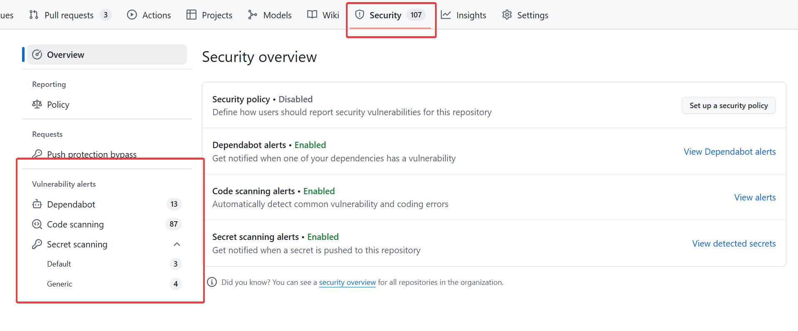
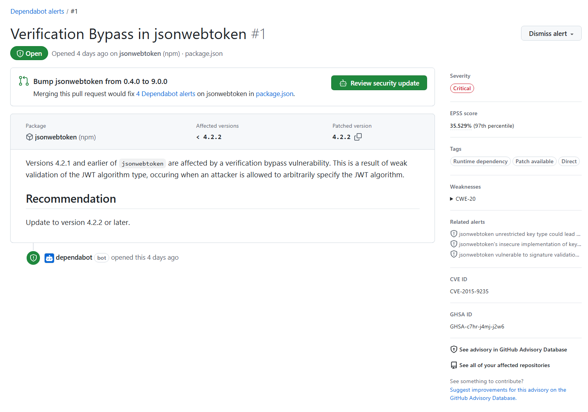
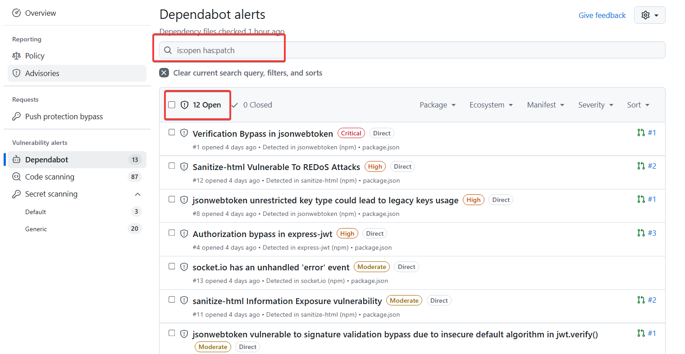
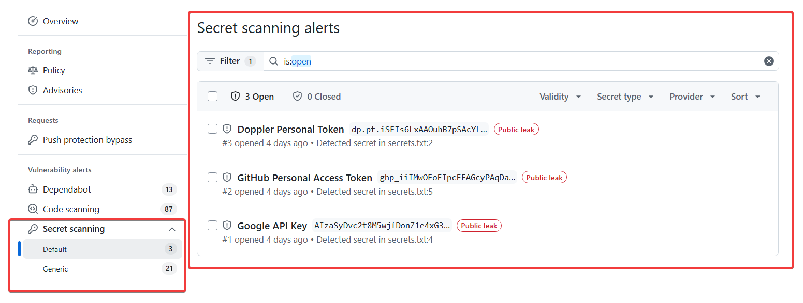

## Lab 2 - Reviewing and Managing Security Alerts

Now that we have all of the security feature enabled, let's review the security alerts that have been created and how to manage them.

## Exercise 1: Reviewing Dependabot alerts

1. [] Click the **Security** tab in the repo. This is where you can see and manage all of the security alerts for the repo.
2. [] Click **Dependabot** under the **Vulnerability alerts** heading.

  

3. [] You should see a number of Dependabot alerts with various severities. Click on one of the alerts to see more information about it.

  

4. When reviewing a Dependabot alert, you can see the following information (see if you can locate this information in the alert you opened):
   - The severity of the alert
   - The package name and version that is vulnerable
   - The severity of the vulnerability
   - The CVE number
   - The affected versions of the package
   - The fixed version (if there is one - sometimes there isn't a non-vulnerable version to upgrade to)
   - The dependency path (what file contains the vulnerable dependency)
   - Is it a runtime or development dependency?
   - Is it a direct or transitive dependency
   - The alert description
   - The alert recommendation (to upgrade or use a different package)
   - The alert timeline (for example, it should show that Dependabot just recently opened the alert. Once you close an alert, it will show who and when closed it here too).

  

5. [] You can manually close an alert by clicking on the **Dismiss alert** button in the upper right hand corner. It's not recommended to close alerts manually, but there may be times where this is helpful (for example, the code that contains the alert is not used).
    - If you resolve an alert by upgrading to a non-vulnerable version, Dependabot will automatically close the alert!
6. [] Go back a page and return to the list of Dependabot alerts.
7. [] Click on the **Command Injection in marsdb** alert. You will note that this alert does not have a non-vulnerable version to upgrade to.
    - If this were a real application, you would need to evaluate your risk to keeping this package in place, migrate to a different package, or write the functionality in-house.
8. [] Go back a page and return to the list of Dependabot alerts.
9. [] Click on the **Verification Bypass in jsonwebtoken** alert. This alert *does* have a non-vulnerable version to upgrade to.
10. [] If Dependabot has finished running, you should see a **Review security update** button attempt. If you see it, click it.
    - If you don't see it, skip to the next step. You can return to this step later after Dependabot finishes its initial run.
    - Review the PR that Dependabot created by clicking on the **Review security update**.
    - In the **Files changed** tab, you should see it upgrading the **package.json** file.
    - Back on the **Conversation** tab, you can see that the compatibility score is pretty low - this is an indication that you would likely going to have to make code changes to accept this PR.
    - Dependabot security updates is a great feature because assuming your build and tests pass, you can merge the PR and automatically close the alert.
11. [] Navigate **back** to the **Dependabot** alerts page and let's take a look at the list of Dependabot alerts one final time.
12. [] We can filter by **Package**, **Ecosystem**, **Manifest**, and **Severity**. For example, sometimes upgrading just one package can resolve multiple security alerts, so this can be a great way to prioritize fixes.
    - Note that if you click the package dropdown, one package has 6 alerts associated with it (all linked to the same PR).
    - This is a great place to start if you are looking to start prioritizing which alerts to fix first.
    - Reviewing the **Critical** and **High** security alerts is another great place to start when prioritizing.

  

13. [] If you put your cursor in the search box (should have `is:open` by default), there are additional filter options. Some of the common filter options are **scope** (runtime or development) and **has** (for example, `has:patch`).
14. [] Update the search query to `is:open has:patch`. This will filter out all of the alerts that don't have a patch available and only show alerts where there is a non-vulnerable version to upgrade to.

  

15. [] Auto-triage your alerts allows you control over how Dependabot opens pull requests, ignores false positives and snoozes alerts. Navigate to  the **Settings** tab (the icon of the gear)  in the repo and then **Code Security** left sidecar, scroll to **Dependabot**, then find **Dependabot rules** underneath **Dependabot alerts**.

16. []  Add a rule to snooze any alerts that do not have a fix available.  Choose the "gear" icon and select the **New rule** button.  Name the rule `Snooze when no patch available`, add a target metadata for all npm packages: `ecosystem:npm` and ensure the **Dismiss Alerts - Until patch is available** is selected.  Next, select **Create rule**.

  

17. [] Navigating back to the **Security** tab /  **Dependabot** under the **Vulnerability alerts** heading. You will see **1 Closed** heading.  Select this to find your alert **Command Injection in marsdb** without any fix has now been **Dismissed** as **auto-dismissed**.  The audit log will note **Repository rule created and Snooze when no patch available was applied**

  

## Exercise 2: Reviewing Code Scanning alerts

1. [] Under the **Security** tab in the repo, click on **Code scanning** to review the code scanning alerts.
2. [] We should have a number of alerts. If you don't see any alerts yet, skip ahead to the next exercise and come back to this one. More than likely, the code scanning workflow hasn't finished yet (it takes between 2-5 minutes to run).

  

3. [] If there are code scanning alerts, spend a few moments reviewing them. We can **filter/sort** by severity, tool, language, and a few other options, just like with Dependabot alerts.
4. [] A common search/filter to use is **Autofilter** to filter out the alerts with a **test** tag (code scanning violations found in test files). This can help you focus on the alerts that are more likely to be real vulnerabilities.
5. [] To use the autofilter filter, paste this into the search box: `is:open branch:main autofilter:true` (or type/select it by hand).

  

6. [] Scroll down and let's click on one of the SQL injection alerts. These can be found by searching for the title `"Database query built from user-controlled sources"`.
7. [] After clicking into one of the alerts, we should notice a few things:
   - The severity of the alert
   - The CWE(s) of the alert with a hyperlink
   - The tool that found the alert (CodeQL)
   - The alert title
   - The alert description
   - More information on the alert, such as a recommendation and example of the vulnerability (and often additional resources to reference)
   - The alert file path, line number, and code snippet
   - The affected branch

  

8. [] Click on the **Show paths** link to review the vulnerability from the source to the sink.
    - CodeQL works by scanning the sources and sinks; as an example, the source is the user input and the sink is the database query
    - This can help you understand the vulnerability and track it throughout the application to better understand how to fix it.
9. [] Click on the **Show more** expandable section near the bottom of the page.
    - This will show more information about the type of code vulnerability you're working with, how to avoid it, and how to fix it.
10. [] Right below the alert title on the right hand side, there is a **Generate fix** button. Click it!
    - This uses the AI power of Copilot to generate a fix for the vulnerability.
    - This is a great way to learn how to fix the vulnerability and to see how to fix it in the context of your code.
11. [] It will take a little time (30-60s) to generate a suggestion. Wait for it to finish.
12. [] If you're happy with the suggestion, click the **Commit to a new branch** button.
13. [] Accept the defaults and click **Commit change**.
14. [] This will create a **draft** pull request with the fix for the vulnerability. In a real world example, assuming your build and tests pass, you would move the PR out of a draft state, having someone on your team review it, and then merge the change.
    - The nice thing with code scanning alerts (just like Dependabot alerts) is that once you merge the code and is scanned again that resolves an alert, the alert will be automatically closed. This is because the alert is no longer present in the code.

  

15. [] We will merge this in change in. But first, we have to wait for the CodeQL workflow to finish running to ensure we aren't introducing any *new* vulnerabilities into the codebase. The workflow run will take 2-5 minutes (watch the running workflow in the Checks section to check when it's completed (circle changes from yellow to green and says "All Checks have passed")).
16. [] Once the workflow finishes, click **Ready for review**. This moves the pull request out of the draft state.
17. [] Afterwards, click **Merge pull request** and then **Confirm merge**.
    - After merging the code into the default branch, a code scan will run and once it finishes, the alert will be closed.
    - You can test this by merging the pull request we just created! It will take a few minutes for the code scanning to run and close the alert.
18. [] Now that our new code has been merged, let's go watch the workflow scan run. Click on the **Actions** tab at the top of the page.
19. [] Select **CodeQL** on the left side of the page. This shows you all the default runs for the CodeQL workflow. You should see a workflow running right now for our push to main
20. [] Click the running workflow to see the details of the run. You can review the logs to see what CodeQL is doing behind the scenes here if you want!
21. [] Once the workflow completes successfully, return to the **Security** tab and check back on the list of code scanning alerts. You should see one (1) **Closed** alert listed - yay! 🎉

> [!NOTE]  
> You don't need a Copilot license in order to use the Copilot features with GitHub Advanced Security. However, Copilot can certainly be helpful in resolving issues in your IDE and Copilot chat can explain the vulnerability and how to fix it.

## Exercise 3: Reviewing Secret Scanning alerts

1. [] Under the **Security** tab in the repo, click on the **Secret scanning** --> **Default** option. This will show all of the default secret scanning alerts.
2. [] You should see a number of alerts. For example, there should be a **GitHub Personal Access token alert**. Click it.
    - This page shows where in the code the secret was discovered (if there were multiple locations, it would list them all).
    - If a secret is found in the code, we would want to revoke manually in the designated service.
    - It's recommended to revoke the secret instead of rewriting history because the secret was exposed and you don't know who may have seen it.
    - If you re-write history, the secret will still be valid and could be used by an attacker. Also, re-writing history modifies commit hashes and can make traceability more difficult.

  

3. [] You can click on **Verify secret**. It will say it's not currently valid on **github.com**, but that doesn't mean it doesn't come from another GitHub instance (such as GitHub Enterprise Server). (clicking may not be there, since we enabled automatic visibility checked it may have been checked already, or it may even say the secret has been Publicly leaked).
4. [] Go back to list of secret scanning alerts. Click on the **Google API key** alert.
5. [] Click on **Verify secret** again. This time, it should say **secret inactive** (or **Publicly leaked inactive secret**). This is a good candidate to **Close as** --> **Revoked** (click the **Close as** button in the upper right to do so), select **Revoked** and click on **Close Alert**.
    - Unlike Dependabot alerts and Code Scanning alerts, secret scanning alerts are not automatically closed when the secret is removed from the code - whether by a new commit or by re-writing history. This is because the secret was exposed and you don't know who may have seen it. So, you have to manually close the alert once you revoke the token.
6. [] Navigate back to the **Default** secret alerts list.
7. [] We can click **1 Closed** to see the alert we just closed.

  

8. [] Click on the **Generic** secret scanning alerts option. This will show all of the alerts that are not high confidence, such as generic passwords, keys, and things such as HTTP bearer authentication header tokens found in the code.
9. [] Let's click into one of the found **Generic** alerts.

  

10. [] Just like high confidence secret scanning alerts, it shows where the secret was found in the code. The secret was found with AI, so it may or may not be a real secret or password. If it's not, we can close it manually and mark it as a false positive.

## Summary

Well done! You've learned how to review and triage alerts from Dependabot, code scanning, and secret scanning. And you even saw how you can use Copilot to automatically fix a code scanning alert. In the next lab, we are going to to get hands-on with code scanning, repository rulesets, and Copilot, to see how we can both prevent and fix vulnerabilities in our code base.

